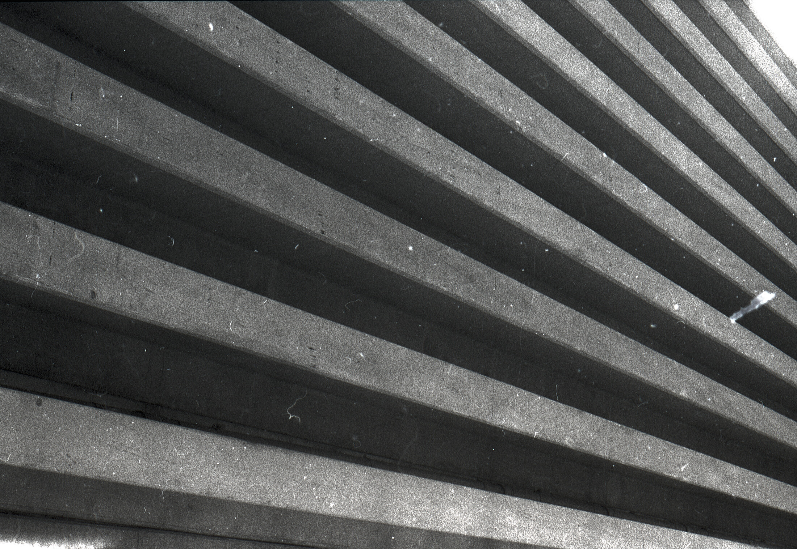

## This film is AWESOME
ILFORD's Delta 3200 is an extremely sensitive film. While it's one of the grainiest films I've ever shot, it has a really lovely character, producing aesthetically pleasing images reminiscent of the pre-WW2 era.

Delta 3200 being an <abbr title="International Organization for Standardization">ISO</abbr> 1000 film is an open secret by now[^1]. I decided to meter it for ISO 1600 this time.

Autoportrait; shot on Delta 3200; Nikon F60 + Nikkor 50mm f/1.4

## How to process Delta 3200?
Developing and fixing Delta 3200 is as simple as processing any other black & white film.
I decided to use the Foma's FOMADON EXCEL developer as it is fairly cheap and allegedly produces sharp negatives.

Shot on Delta 3200; Nikon F60 + Nikkor 50mm f/1.4

## Final thoughts
Delta 3200 is an awesome film. Thanks to the higher sensitivity, it is really a fun film to shoot - it's a no brainer for any darker environment. The results at ISO 1600 surprised me. The resolution isn't high, but way higher than I expected.

[^1]: ILFORD Delta 3200 Professional [Technical Information](https://www.ilfordphoto.com/amfile/file/download/file/1913/product/682/) November 2018

